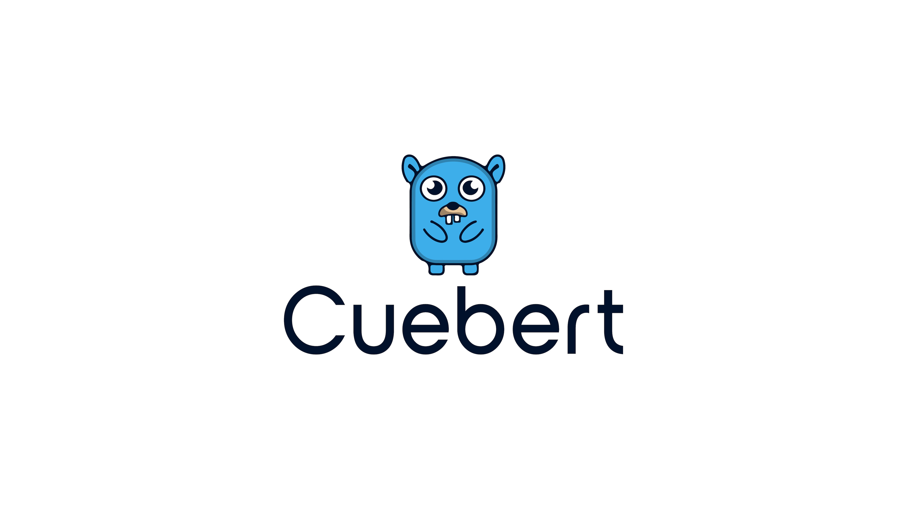
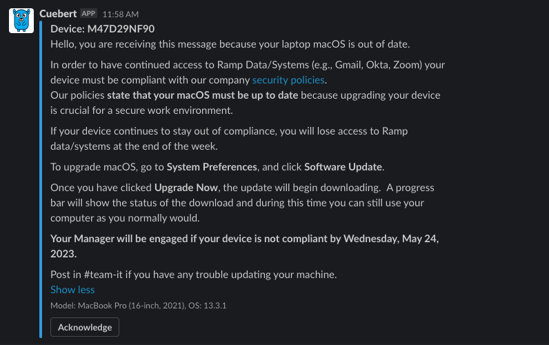
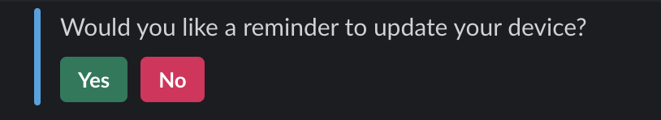
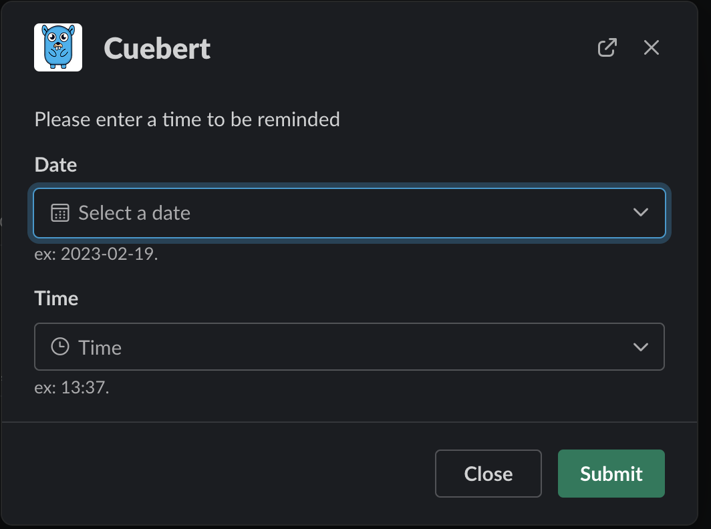
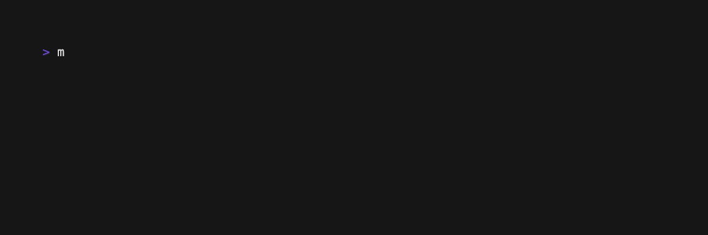
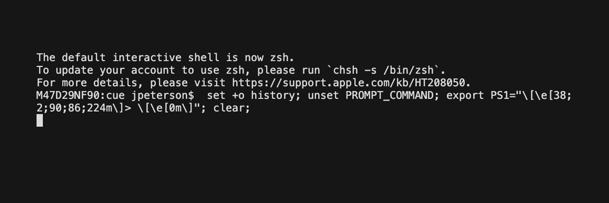
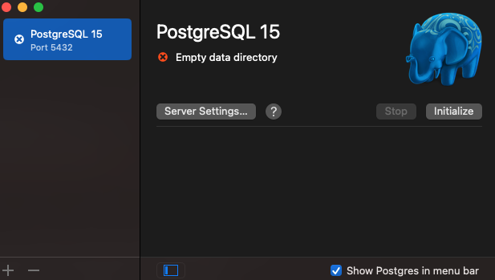
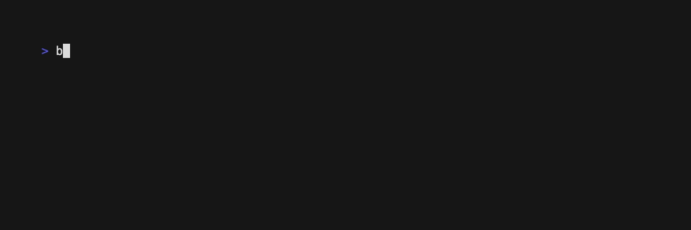
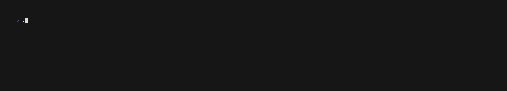

<div align="center">
<h1 align="center">

<br>
cuebert
</h1>
</div>


## 📚 Table of Contents

- [📍Overview](#overview)
- [⚙️ Credential Configuration](#credential-configuration)
- [🏗️ Structure](#structure)
- [📊 Diagram](#diagram)
- [🔄 Flow](#flow)
- [🖼️ Images](#images)
- [💬 Messaging](#messaging)
- [⏰ Reminders](#reminders)
- [🧪 Testing](#testing)
- [🗄️ DB](#db)
- [🧩 Modules](#modules)
- [📚 Resources](#resources)
- [🏎💨 Getting Started](#getting-started)
- [🗺 Roadmap](#future-development)
- [🤝 Contributing](#contributing)
- [👏 Acknowledgments](#acknowledgments)

______________________________________________________________________

## Overview

### Cuebert
Cuebert is a slackbot to help encourage users to upgrade the OS on their machine(s). Written in Go this program is intended to be lightweight, fast, and scalable.
Cuebert is simple bot - pass the required OS version and deadline as arguments, and any other relevant flags, and the process will begin. <br />

The goal of Cuebert is empowering the end user. Offering custom reminders and the ability to leverage exclusions, this program seeks to let the user decide when the right time to upgrade is while giving them subtle reminders to do so. By having the fleet on the latest, or latest major, release we reduce a significant attack vector. Apple has made it clear the only fully updated OS is the latest OS. So while old versions might get some security patches they are not getting the full attention of the latest version. <br />

When Apple pushes out a new release IT will test the updates. Once the update has met the acceptance criteria the minimum required version and date will be updated and Cuebert will begin its reminder cycle.
<br />

This program was written using Slack's [socket mode](https://api.slack.com/apis/connections/socket) making testing quick and easy. There is no need for callback urls or public listener's, Cuebert will be "live" wherever you run it from. <br />

### Cue
Cue is a tool for administrators used to interact with the database. You can add, delete, update, and query information without having to put together the SQL to do so.<br />

At a high level there are two main functions of cue - manipulate the DB and interact with information in the DB. Under each of these high-level ideas are dozens of actions to take that allow an intuitive method to accomplish your task.<br />
______________________________________________________________________

## Credential Configuration

There are three ways to store the required credentials for the program environmental variables, configuration file, and the system keychain.<br />

If testing locally the program will default to `-env-type=dev` which handles authentication through the system keychain using [keyring](https://github.com/zalando/go-keyring). If running the program in production it is recommended to set the credentials as environmental variables.<br />

To set the environmental variables take any of the json key [values](cmd/cuebert/config.go#L17-28) in the `CuebertConfig` struct, prepend them with the [EnvPrefix](cmd/cuebert/config.go#L42), and export the value. <br />

ex: <br />
```
export CUEBERT_DB_ADDRESS=localhost
export CUEBERT_DB_USER=cue
```
<br />

While the other two methods are preferred, you may also store the values in a local json configuration file. <br />
```
{
    "db_address": "localhost",
    "db_name": "cue",
    ...
}
```
<br />

______________________________________________________________________
## Flow

By default when the program starts the four tables are deleted. Pulling the data and populating the tables takes roughly 2-3 seconds and ensures we start with a fresh data set. Should you wish to keep the data pass `-clear-tables=false`. <br />

After reading in the configuration needed to start the first action takin is to start a goroutine to respond to user input. This handles any messages sent to Cuebert, reminder modal input, acknowledgement of messages sent, or any information Cuebert would need to respond to. <br />

Once the configuration has been read in and the tables have been populated the `bot_results` table is configured. This pulls data from the `devices` and `users` table to gather the information on the user, and their manager, needed to begin.<br />
<br />

At this point Cuebert begins maintenance tasks. Three routines are started and will repeat on a set time interval.<br />

* Device Diff
    - Every 60 minutes the [deviceDiff](cmd/cuebert/devices.go) function runs to pull info from the DB, compare that to the MDM information, and update where necessary. This ensures we are not messaging users who have updated in between reminders and always operating of fresh device data. If a device is above the required version it will be dropped from the table during this.
<br />

* Check
    - Every 30 minutes [check](cmd/cuebert/check.go) runs to see if messaging needs to be sent to the user. The information is pulled from the `bot_results` table which stores if a user has been sent the message and when/if they responded. If the conditions are met where the user should be notified that will occur.
<br />

* Poll Reminders
    - Every 15 minutes [pollReminders](cmd/cuebert/check.go) runs to see if anyone needs a custom OS upgrade reminder set. Since a user can set a reminder for any point, at any time, we need to regularly check this data. Should a reminder be set in within the next 15 minutes of check running a routine is started to remind the user at that time.
<br />
______________________________________________________________________

## Messaging 
There are two main messages Cuebert will send. The first is sent once a new os requirement is set to inform the user an upgrade is required.<br />

<br />
This notification comes with a button for the user to acknowledge they have received the message. When the button is clicked it is recorded that the message has been read and the time at which this was done. This action allows us to verify that the user knows there is a required update and that they have agreed to do it within the alloted time frame.<br />

The second message is sent midweek which creates a group DM between Cuebert,the users manager, and the user _if_ the device is still out of compliance.
______________________________________________________________________

## Reminders
At anytime a user can request a reminder to upgrade. A prompt appears to ask if the user would like to set a reminder.<br />

<br />

If the user clicks yes a date/time modal appears to set the reminder.<br />
<br />

<br />
______________________________________________________________________

## Testing
By passing cuebert the `-testing` and `-testing-users` flags you can simulate the actions that would take place during messaging.<br />

The testing flag is a bool value. The testing users is a comma-separated lists of Slack ID's to act on as the program normally would while logging what would happen to others. This flag is very useful for beta testing against IT and other willing participants.

An example of a possible testing scenario:
> `./build/darwin/cuebert -deadline-date 2023-05-09 -cutoff-time 18:00:00 -log-level=trace -required-os 13.4.1 -auth-users=ABC123,DEB456 -testing=true -clear-tables=false -testing-users=ABC123`

## Setup
To test locally we first need to setup Postgres. This can be done by downloading the standalone Postgres [package](https://www.postgresql.org/download/macosx/) or by creating a Postgres Docker image.<br />

The docker image is going to be quicker to get up and running but either option will work.

<br />

### Docker Postgres
`make run-docker-postgres`<br />
This will build the [Dockerfile](resources/Docker/postgres/Dockerfile), configuring the database as we need it and starting Postgres.

To connect to the db you can:
* exec into the container<br />


<br />

* use `psql` if you have the postgres binaries installed locally.


<br />
<br />

### Standalone Postgres
* Download the [latest](https://www.postgresql.org/download/macosx/) version.
* Move to Applications folder ➜ Open.
* Click `Initialize`<br />

* You now have a PostgreSQL server running on your Mac with these default settings:
    - Host: localhost
    - Port: 5432
    - User: your system user name
    - Database:	same as user
    - Password:	none
* Configure your $PATH to use the included command line tools (optional):
    - `sudo mkdir -p /etc/paths.d && echo /Applications/Postgres.app/Contents/Versions/latest/bin | sudo tee /etc/paths.d/postgresapp`
* Run the init [script](resources/db/create.sh) to configure the DB as needed. <br />


---

Once the database has been configured run either cue or cuebert to interact as needed.
* Unless you have changed some of the default values the connection information should:
    - Host: localhost
    - Port: 5432
    - User: cue
    - Database:	cue
    - Password:	cue
<br />

Now you can authenticate and start using the tools.

<br />
______________________________________________________________________

## DB
The database is shared by both programs to store information on the users, devices, bot results, and exclusions. Each table has its own tooling defined under [db](db/) that help facilitate interactions with the table. By design the functionality and code is very similar between each of these packages - they are meant to be fully independent of one another while feeling similar when moving between them.
<br />

## Tables
The four table definitions can be found [here](resources/db/create_tables.sql)<br />
* bot results<br />
    - This table is the one Cuebert will be writing state information to about interactions with the user such as when a user acknowledges or receives a message, the time it occurred, etc.
* devices<br />
    - Information about the device. All information is pulled from the MDM to store the device serial, os, platform, and user.
* users<br />
    - Used to correlate information between the MDM device users and their Slack ID.
* exclusions<br />
    - Devices to be excluded from receiving messaging.
<br />

### Creating tables
To help automate the creation of the tables, especially when testing, there is a [script](resources/db/create.sh) that can be used.<br />
This does make some assumptions on the default user of the db (postgres) but that can be overridden with flags.
<br />

Create the cue user, db, tables, and triggers.<br />
`bash resources/db/create.sh -a true`<br />
Create the cue user<br />
`bash resources/db/create.sh -u true`<br />
Create the DB<br />
`bash resources/db/create.sh -d true`<br />
Create the tables<br />
`bash resources/db/create.sh -t true`<br />
Create the triggers<br />
`bash resources/db/create.sh -tr true`<br />
<br />
______________________________________________________________________


## Structure
```bash
repo
.
.
├── LICENSE
├── Makefile
├── README.md
├── action
│   └── readme.md
├── build
│   ├── darwin
│   │   ├── cue
│   │   └── cuebert
│   └── linux
├── cmd
│   ├── cue
│   │   ├── botresults.go
│   │   ├── botresults_get.go
│   │   ├── botresults_remove.go
│   │   ├── cue.go
│   │   ├── db.go
│   │   ├── db_config.go
│   │   ├── db_init.go
│   │   ├── devices.go
│   │   ├── devices_add.go
│   │   ├── devices_get.go
│   │   ├── devices_remove.go
│   │   ├── devices_update.go
│   │   ├── exclusions.go
│   │   ├── exclusions_add.go
│   │   ├── exclusions_get.go
│   │   ├── exclusions_remove.go
│   │   ├── tables.go
│   │   ├── users.go
│   │   ├── users_add.go
│   │   ├── users_get.go
│   │   ├── users_remove.go
│   │   └── util.go
│   └── cuebert
│       ├── alert.go
│       ├── authorized.go
│       ├── authorized_test.go
│       ├── bot.go
│       ├── check.go
│       ├── config.go
│       ├── config_loader.go
│       ├── cuebert.go
│       ├── cycle.go
│       ├── devices.go
│       ├── exception.go
│       ├── flags.go
│       ├── health.go
│       ├── health_test.go
│       ├── help.go
│       ├── locale.go
│       ├── locale_test.go
│       ├── manager.go
│       ├── message.go
│       ├── modal.go
│       ├── remind.go
│       ├── reports.go
│       ├── tables.go
│       └── user.go
├── db
│   ├── bot
│   │   ├── add.go
│   │   ├── bot.go
│   │   ├── query.go
│   │   ├── remove.go
│   │   └── update.go
│   ├── compare
│   │   └── compare.go
│   ├── create
│   │   └── create.go
│   ├── db.go
│   ├── devices
│   │   ├── add.go
│   │   ├── devices.go
│   │   ├── query.go
│   │   ├── remove.go
│   │   └── update.go
│   ├── exclusions
│   │   ├── add.go
│   │   ├── exclusions.go
│   │   ├── query.go
│   │   ├── remove.go
│   │   └── update.go
│   ├── parser
│   │   └── parser.go
│   └── users
│       ├── add.go
│       ├── query.go
│       ├── remove.go
│       ├── update.go
│       └── users.go
├── go.mod
├── go.sum
├── idp
│   ├── all.go
│   ├── client
│   │   └── client.go
│   ├── idp.go
│   └── okta
│       ├── client.go
│       ├── group.go
│       ├── user.go
│       └── util.go
├── internal
│   ├── db
│   │   ├── bot.go
│   │   ├── db.go
│   │   ├── devices.go
│   │   ├── exclusions.go
│   │   ├── reminder.go
│   │   ├── tables.go
│   │   └── users.go
│   ├── device
│   │   └── device.go
│   ├── env
│   │   ├── env.go
│   │   └── env_test.go
│   └── user
│       └── user.go
├── mdm
│   ├── all.go
│   ├── client
│   │   ├── client.go
│   │   └── client_test.go
│   ├── jamf
│   │   └── client.go
│   ├── kandji
│   │   ├── client.go
│   │   ├── device_entity.go
│   │   ├── devices.go
│   │   └── user.go
│   └── mdm.go
├── pkg
│   ├── auth
│   │   ├── auth.go
│   │   ├── auth_test.go
│   │   ├── prompt.go
│   │   └── prompt_test.go
│   ├── helpers
│   │   ├── strings.go
│   │   ├── strings_test.go
│   │   ├── structs.go
│   │   ├── structs_test.go
│   │   ├── time.go
│   │   ├── time_test.go
│   │   ├── url.go
│   │   └── url_test.go
│   ├── logger
│   │   ├── logger.go
│   │   └── logger_test.go
│   ├── slack
│   │   ├── client.go
│   │   ├── client_test.go
│   │   ├── user.go
│   │   └── user_test.go
│   ├── version
│   │   └── version.go
│   └── visual
│       ├── build.go
│       ├── build_test.go
│       ├── pie.go
│       └── pie_test.go
└── resources
    ├── Docker
    │   ├── cue
    │   │   └── Dockerfile
    │   ├── cuebert
    │   │   └── Dockerfile
    │   └── postgres
    │       └── Dockerfile
    ├── db
    │   ├── create.sh
    │   ├── create_db.sql
    │   ├── create_tables.sql
    │   ├── create_triggers.sql
    │   ├── create_user.sql
    │   └── cue.sql
    ├── images
    │   ├── bertcue
    │   │   ├── appiconset
    │   │   │   ├── 100.png
    │   │   │   ├── 102.png
    │   │   │   ├── 1024.png
    │   │   │   ├── 114.png
    │   │   │   ├── 120.png
    │   │   │   ├── 128.png
    │   │   │   ├── 144.png
    │   │   │   ├── 152.png
    │   │   │   ├── 16.png
    │   │   │   ├── 167.png
    │   │   │   ├── 172.png
    │   │   │   ├── 180.png
    │   │   │   ├── 196.png
    │   │   │   ├── 20.png
    │   │   │   ├── 216.png
    │   │   │   ├── 256.png
    │   │   │   ├── 29.png
    │   │   │   ├── 32.png
    │   │   │   ├── 40.png
    │   │   │   ├── 48.png
    │   │   │   ├── 50.png
    │   │   │   ├── 512.png
    │   │   │   ├── 55.png
    │   │   │   ├── 57.png
    │   │   │   ├── 58.png
    │   │   │   ├── 60.png
    │   │   │   ├── 64.png
    │   │   │   ├── 66.png
    │   │   │   ├── 72.png
    │   │   │   ├── 76.png
    │   │   │   ├── 80.png
    │   │   │   ├── 87.png
    │   │   │   ├── 88.png
    │   │   │   ├── 92.png
    │   │   │   └── Contents.json
    │   │   ├── appstore.png
    │   │   └── bertcue.png
    │   └── cuebert
    │       ├── Cover-2.jpg
    │       ├── Cover.jpg
    │       ├── FF-01.jpg
    │       ├── FF-01.png
    │       ├── FF.ai
    │       ├── FF.pdf
    │       ├── cuebert-bold.pdf
    │       ├── cuebert-dark.png
    │       └── cuebert.jpg
    ├── manifest
    │   ├── prod.json
    │   └── testing.json
    └── scripts
        ├── create_tapes.py
        ├── readme_images.py
        └── util.py

47 directories, 189 files
```
______________________________________________________________________
## Diagram
<details>
  <summary>Expand</summary>
  
</details>
______________________________________________________________________


## Modules

📝 A brief summary for each module is provided below as provided by OpenAI.<br>
An always up-to-date version of this table can be found [here](.docs/packages/README.md) until I can automate it being here.

______________________________________________________________________

<details closed><summary>auth</summary>

| File | Summary | Module |
|:--- |:--- |:--- |
| prompt_test.go | Package auth contains functions for authenticating users. TestRunReturnsErrorWhenReadPasswordFails tests that when the stubPasswordReader returns an error, the run() function returns an error. TestRunReturnsPasswordInput tests that when the stubPasswordReader returns a password, the run() function returns the password. | [pkg/auth/prompt_test.go](../../pkg/auth/prompt_test.go) |
| auth_test.go | This package contains functions for setting and getting keys in the keyring, generating random strings, and converting secrets to a map. It also contains tests for each of these functions. | [pkg/auth/auth_test.go](../../pkg/auth/auth_test.go) |
| auth.go | This Go code is part of a package called "auth" and imports the packages "fmt", "github.com/rs/zerolog/log", and "github.com/zalando/go-keyring". It contains a variable called "interactive" and a struct called "Secret". It also contains a constant called "svc" and several functions: "notFound", "checkKey", "setKey", "getKey", " | [pkg/auth/auth.go](../../pkg/auth/auth.go) |
| prompt.go | This Go code package provides a way to read passwords from stdin or from a stubbed reader. It includes a PasswordReader interface, a StdInPasswordReader struct, a BuildPrompt function, a readPassword function, a run function, a stubPasswordReader struct, and a Prompter struct. The SensitiveInputPrompt function provides a way to read a password from either stdin or a stubbed reader depending on the value of the Interactive flag. | [pkg/auth/prompt.go](../../pkg/auth/prompt.go) |

</details>
<details closed><summary>bot</summary>

| File | Summary | Module |
|:--- |:--- |:--- |
| update.go | This Go code is from a package called "bot" and is used to update a device in a database. It initializes a new BotResUpdate struct and has methods to modify which values will be updated. It then parses the input and composes a statement to send to the database, and returns a connection which should be closed after checking the error. | [db/bot/update.go](../../db/bot/update.go) |
| bot.go | This Go code imports the necessary packages and creates a struct called BotResInfo which represents the columns in the devices table. It then creates a function called Bot which is used to interact with the devices table. The function takes in a pgxpool.Pool and a logger.Logger as parameters and returns a Config struct. The Config struct contains the necessary information to interact with the devices table. | [db/bot/bot.go](../../db/bot/bot.go) |
| remove.go | Package bot contains a Remove struct which is used to remove entries from a database table. The Remove struct is initialized with a Config struct and contains methods to designate specific fields of the statement that will be inserted once Execute is called. The Execute method sends the statement to remove the device after it has been composed. There are also methods to remove based off of different criteria such as delay sent, first message waiting, full name, manager slack ID, manager message | [db/bot/remove.go](../../db/bot/remove.go) |
| query.go | This Go code creates a BotResQuery struct which is used to interact with specific columns in the bot_results table. It also contains functions to query the table for specific values and execute the query against the database. The functions include All(), FirstACK(), FirstACKTime(), FirstMessageSent(), DelayAt(), DelaySent(), SlackID(), ManagerSlackID(), FirstMessageWaiting(), FullName(), ManagerMessageSent(), Serial(), TZ(), TZS(), | [db/bot/query.go](../../db/bot/query.go) |
| add.go | TZOffset will update the value for the users timezone offsetfunc (u *BotResUpdate) TZOffset(o int) *BotResUpdate {	u.bresp.TZOffset = o	return u}This Go code creates a BotResUpdate struct and associated functions to add, update, and execute a statement to add a bot response to a database. The BotResUpdate struct contains fields for the bot | [db/bot/add.go](../../db/bot/add.go) |

</details>
<details closed><summary>client</summary>

| File | Summary | Module |
|:--- |:--- |:--- |
| client_test.go | This Go code imports the packages "github.com/johnmikee/cuebert/mdm" and "github.com/johnmikee/cuebert/mdm/jamf" and "github.com/johnmikee/cuebert/mdm/kandji" and then tests the creation of a Jamf and Kandji MDM provider using the "New" function. The type of the returned provider is checked and logged if | [mdm/client/client_test.go](../../mdm/client/client_test.go) |
| client.go | This Go code creates a new IDP provider using the idp.Provider interface. It imports the idp and okta packages from github.com/johnmikee/cuebert. It defines a Config struct and an IDP struct. The New() function creates a new IDP provider and sets up the configuration. The createIDPProvider() function creates a provider based on the provider name, and returns an okta.Client if the provider name is id | [idp/client/client.go](../../idp/client/client.go) |
| client.go | This Go code package creates an MDM provider based on the provided MDM configuration. It contains a Config struct that stores the MDM provider, a MDM struct that stores the MDM and the Config, a New function that creates a new MDM provider based on the provided MDM configuration, and a createMDMProvider function that creates and returns an MDM provider based on the provided MDM type. | [mdm/client/client.go](../../mdm/client/client.go) |

</details>
<details closed><summary>compare</summary>

| File | Summary | Module |
|:--- |:--- |:--- |
| compare.go | Package compare provides helper functions to build a query with a comparison operator and to check if a time.Time object or int is zero and return nil if it is. The comparison operators are Equal, GreaterThan, GreaterThanOrEqual, LessThan, and LessThanOrEqual. | [db/compare/compare.go](../../db/compare/compare.go) |

</details>
<details closed><summary>create</summary>

| File | Summary | Module |
|:--- |:--- |:--- |
| create.go | This package is used to build the database tables when the program starts up. It acquires a connection to the database, then creates tables for users, devices, exclusions, and bots. It also creates triggers for log_last_updated, bot_notify_event, update_device_time, update_user_time, and update_bot_time. | [db/create/create.go](../../db/create/create.go) |

</details>
<details closed><summary>cue</summary>

| File | Summary | Module |
|:--- |:--- |:--- |
| exclusions_add.go | This Go code creates a flagset with flags for a device serial number, device owner's email, explanation for exclusion, and a date for the exclusion to last until. It then checks that both the serial number and email have been provided and parses the date. Finally, it adds the exclusion to the database. | [cmd/cue/exclusions_add.go](../../cmd/cue/exclusions_add.go) |
| util.go | This Go code contains functions to extract flag values from a given set of arguments, validate arguments for an 'add' command, and execute a shell command with given arguments. | [cmd/cue/util.go](../../cmd/cue/util.go) |
| users_add.go | This Go code creates a command line utility to add users to a database. It defines two functions, addUsers and addSome, which handle the user input and add the users to the database. It also defines a flagset to parse the user input and store it in variables. | [cmd/cue/users_add.go](../../cmd/cue/users_add.go) |
| db_config.go | This Go code creates a flagset with five boolean flags, each of which prints out a different configuration value from the db package when set to true. It also includes a usageFor function which prints out a usage message for the flagset. | [cmd/cue/db_config.go](../../cmd/cue/db_config.go) |
| users_get.go | This Go code is a part of a command line application that allows users to get information about users from a database or an MDM. The code contains two functions, sourceusage() and getUserSource(), which are responsible for displaying the usage of the command and getting the user information from the specified source, respectively. The getUserSource() function calls either the getUsersDB() or getUsersMDM() functions, depending on the source specified. The getUsers | [cmd/cue/users_get.go](../../cmd/cue/users_get.go) |
| exclusions_remove.go | This Go code creates a flagset for the command "cue exclusions remove [flags]" which allows the user to remove a user row based on either the email or the users long name. The code then checks if more than one argument is set and returns an error if so. Finally, it executes the removal of the exclusion and returns any errors. | [cmd/cue/exclusions_remove.go](../../cmd/cue/exclusions_remove.go) |
| botresults_get.go | This Go code imports the "flag" and "strconv" packages, as well as the "github.com/johnmikee/cuebert/db/bot" package. It creates a function that uses the flag package to parse arguments and then uses the imported "bot" package to query the database for bot results. The results are then printed using the "brPrinter" function. | [cmd/cue/botresults_get.go](../../cmd/cue/botresults_get.go) |
| users_remove.go | This Go code is part of a package main and imports the "flag" and "fmt" packages. It contains a function that removes users from a database based on various criteria, such as ID, email, long name, and Slack ID. The function takes in an argument of type string and returns an error. A flag set is created to parse the arguments and a usage message is set. A base is set to remove users by and a count is set to 0. | [cmd/cue/users_remove.go](../../cmd/cue/users_remove.go) |
| exclusions.go | This Go code is part of the 'cue exclusions' command which allows users to add, get, and remove exclusions from the database. It imports various packages and creates a struct to store the necessary variables. It also contains a usage() function to print out valid options, and a run() function to execute the command. Finally, it contains an exclusionPrinter() function to print out the exclusions from the database. | [cmd/cue/exclusions.go](../../cmd/cue/exclusions.go) |
| tables.go | This Go code creates a package called "main" and imports the "text/tabwriter" package. It also creates a type called "TableOutput" which contains a pointer to a tabwriter.Writer. Finally, it creates a function called "basicFooter" which flushes the tabwriter.Writer. | [cmd/cue/tables.go](../../cmd/cue/tables.go) |
| devices_remove.go | This Go code creates a flagset for removing devices from a database based on various criteria. It sets up flags for device id, model, name, platform, OS, serial, user, and user id. It then checks if more than one flag has been set and returns an error if so. Finally, it executes the removal of the device and returns an error if one occurs. | [cmd/cue/devices_remove.go](../../cmd/cue/devices_remove.go) |
| botresults.go | This Go code imports packages for formatting, logging, and database operations. It creates a struct called BR and defines a usage function for it. It then defines a function called BotRes that takes in a string array of arguments and calls the usage function if the array is empty. It also defines a switch statement that assigns a run function to the struct based on the argument. Finally, it defines a brPrinter function that prints out a table of bot resource information. | [cmd/cue/botresults.go](../../cmd/cue/botresults.go) |
| db_init.go | This Go code is a part of the DB package and contains functions to initialize the database. The dbInit() function is used to parse the arguments and call the appropriate function based on the arguments. The dbSchema() function is used to create the database, user, and tables. The initTableValues() function is used to add values to the devices and users tables. The initusage() function is used to print out the help message for the db init command. | [cmd/cue/db_init.go](../../cmd/cue/db_init.go) |
| devices_get.go | This Go code is used to retrieve device information from either a database or an MDM. It contains two functions, sourceusage() which prints out a help message, and getDeviceSource() which parses the arguments and runs either getDevicesDB() or getDevicesMDM() depending on the argument given. getDevicesDB() and getDevicesMDM() both use flags to query the database or MDM for specific device information. Finally, devicePr | [cmd/cue/devices_get.go](../../cmd/cue/devices_get.go) |
| exclusions_get.go | This Go code imports the flag and strings packages, as well as the exclusions package from the github.com/johnmikee/cuebert/db/exclusions repository. It then defines a function, getExclusions, which uses the flag package to parse command line arguments and then uses the exclusions package to query the database for exclusion information based on the arguments. Finally, it prints the exclusion information using the exclusionPrinter function. | [cmd/cue/exclusions_get.go](../../cmd/cue/exclusions_get.go) |
| db.go | This Go code is a package main that imports fmt, os, strings, github.com/johnmikee/cuebert/internal/db, github.com/johnmikee/cuebert/internal/device, github.com/johnmikee/cuebert/pkg/logger. It defines a DB struct with db, devices, log, and run fields. The DB struct has methods usage(), DB(), infousage | [cmd/cue/db.go](../../cmd/cue/db.go) |
| devices.go | This Go code is part of a package main and imports various packages such as "fmt", "os", "strings", and "text/tabwriter". It also imports various internal packages such as "github.com/johnmikee/cuebert/db/devices", "github.com/johnmikee/cuebert/internal/db", "github.com/johnmikee/cuebert/internal/device", "github | [cmd/cue/devices.go](../../cmd/cue/devices.go) |
| users.go | This Go code is for a package main that imports multiple packages to create a user command line tool. The tool has multiple functions such as add, get, and remove users. The code also includes functions to print out user information from the database and MDM. | [cmd/cue/users.go](../../cmd/cue/users.go) |
| botresults_remove.go | This Go code is part of a package main and imports the flag and strings packages from github.com/johnmikee/cuebert/db. It contains a function that removes bot results from a database based on the flags passed in as arguments. The flags are all, email, serial, slack-id, manager-slack-id, and full-name. The function splits the strings passed in for each flag and uses them to remove the bot results from the | [cmd/cue/botresults_remove.go](../../cmd/cue/botresults_remove.go) |
| devices_add.go | This Go code is part of a program that adds devices to a database. It includes functions to add all devices, add some devices, and add a single device. The addSome function allows for passing either a single item or comma separated list for each option. The addDevice function takes a DeviceInfo struct and adds it to the database. | [cmd/cue/devices_add.go](../../cmd/cue/devices_add.go) |
| devices_update.go | This Go code is part of a package main and imports the flag and fmt packages. It creates a flagset and assigns various flags to strings. It then checks if the condition and condition-val flags are empty and prints an error if they are. It then updates the device based on the flags and returns an error if there is one. | [cmd/cue/devices_update.go](../../cmd/cue/devices_update.go) |
| cue.go | extractFlagValue extracts the value of a flag from the argsfunc extractFlagValue(flagName string, args []string) (string, error) {	for i := 0; i < len(args); i++ {		if strings.Contains(args[i], flagName) {			if len(args) < i+1 {				return "", fmt.Errorf("no value for flag %s | [cmd/cue/cue.go](../../cmd/cue/cue.go) |

</details>
<details closed><summary>cuebert</summary>

| File | Summary | Module |
|:--- |:--- |:--- |
| authorized_test.go | This Go code is testing the output of messages sent to Slack, which are in the form of JSON. It is testing the bot's functions for adding exclusions, and the output of messages sent to Slack when a user requests an exclusion. It also tests the output of a modal view request when a user requests an exclusion. | [cmd/cuebert/authorized_test.go](../../cmd/cuebert/authorized_test.go) |
| check.go | This Go code is for a bot that checks a database table for devices that need to be reminded to update. It handles the first message, acknowledgements, and second message with the user and their manager. It also checks for reminders set by the user and sends them when the time is right. | [cmd/cuebert/check.go](../../cmd/cuebert/check.go) |
| remind.go | This Go code is for a bot that sends a reminder to a user to update their device. It imports packages for logging, Slack, and a database. It contains functions for delivering the reminder, adding the reminder command to the bot, and handling the reminder button and picker modal. It also contains a struct for the reminder info and a function for scheduling the reminder. | [cmd/cuebert/remind.go](../../cmd/cuebert/remind.go) |
| alert.go | This Go code creates a struct called managerAlert which contains an array of missingManager structs and a message string. It then defines a function sendAlert which takes an alert channel and an attachment and sends a message to the alert channel using the attachment. It also defines a function buildAlert which takes a source string and an array of missingManager structs and builds an attachment. Finally, it defines a function alertIfNoManager which takes an alert channel and an array | [cmd/cuebert/alert.go](../../cmd/cuebert/alert.go) |
| cycle.go | This Go code creates a bot with commands for initializing settings, updating configuration, and stopping the bot. It also includes functions for submitting and approving the stop request, and an override for bypassing the approval process. The code imports packages from github.com/johnmikee/cuebert/pkg/helpers, github.com/shomali11/slacker, github.com/slack-go/slack, and github. | [cmd/cuebert/cycle.go](../../cmd/cuebert/cycle.go) |
| health.go | This Go code creates a StatusHandler struct to manage the status of the program and a health check endpoint. It also creates structs to store various status messages, such as StatusMessage, BotStatus, and DBStatus. The code also includes functions to set and get the status, start the health handler, read and send status messages, and update the status. | [cmd/cuebert/health.go](../../cmd/cuebert/health.go) |
| bot.go | This Go code creates a Bot struct which holds the configuration for the bot, interacts with the DB and Slack, and holds the commands. It also has functions to respond to messages, send attachments, and fuzzy match non-optional inputs. | [cmd/cuebert/bot.go](../../cmd/cuebert/bot.go) |
| locale.go | This Go code contains functions to add an offset to a user-inputted date and time string, check if a user-inputted date and time is in the future, generate a location based on an offset, check if a time is within a specified range, get the user's current time based on an offset, calculate the difference between a user-inputted date and time and the current time, and get the next Wednesday. | [cmd/cuebert/locale.go](../../cmd/cuebert/locale.go) |
| message.go | This Go code is for a Bot that sends messages to users with out of date macOS. It imports libraries for crypto/rand, math/big, strconv, time, github.com/johnmikee/cuebert/internal/db, github.com/johnmikee/cuebert/pkg/helpers, github.com/shomali11/slacker, github.com/slack-go/slack, and | [cmd/cuebert/message.go](../../cmd/cuebert/message.go) |
| modal.go | This Go code imports the packages "fmt", "time", "github.com/shomali11/slacker", "github.com/slack-go/slack", and "github.com/slack-go/slack/socketmode". It creates a type called modalGateway which contains text, fallback, callbackID, yesName, yesText, yesValue, yesStyle, noName, noText, | [cmd/cuebert/modal.go](../../cmd/cuebert/modal.go) |
| cuebert.go | This Go code creates a bot that connects to a database, an identity provider, and a mobile device management system. It sets up the bot, connects to the database, and initializes the tables. It then sets up a routine handler to wait for a start or stop signal. When the start signal is received, it runs a series of functions every certain duration, such as checking for device changes, checking for reminders, and sending a daily admin report. When the stop signal is | [cmd/cuebert/cuebert.go](../../cmd/cuebert/cuebert.go) |
| manager.go | This Go code is a part of a Bot program that sends messages to users and their managers when a user has not upgraded their laptop to the latest operating system. It imports the "fmt" and "slack-go" packages, and defines a "missingManager" struct. The "associateUserManager" function checks the list of users who were not added to the database, and the "managerMessaging" function creates a message to be sent to | [cmd/cuebert/manager.go](../../cmd/cuebert/manager.go) |
| reports.go | This Go code creates a bot that can generate reports about a fleet. It imports the necessary packages from github and slack-go. It contains a requestReport function that takes in a parameter and calls the appropriate function to generate the report. It also contains a countSentStatus function that counts the number of sent and not sent messages. Lastly, it contains a sendReport function that uploads the report to the configured channel and a SendDailyAdminReport function that sends a daily report to | [cmd/cuebert/reports.go](../../cmd/cuebert/reports.go) |
| health_test.go | This Go code is testing a StatusHandler struct that contains a StatusMessage struct. The StatusMessage struct contains fields for a message, code, DBStatus struct, and RoutineStatus struct. The code tests the SetStatus() and GetStatus() functions of the StatusHandler struct, and the StartHealthHandler() function which serves a request using a test HTTP handler and returns a JSON response containing the status message. | [cmd/cuebert/health_test.go](../../cmd/cuebert/health_test.go) |
| user.go | This Go code creates two functions that allow a user to request information about themselves or another user from a database. The code imports packages for regexp, strconv, strings, time, github.com/johnmikee/cuebert/db/bot, github.com/shomali11/slacker, and github.com/slack-go/slack. The functions use the database to retrieve user information, such as email, | [cmd/cuebert/user.go](../../cmd/cuebert/user.go) |
| flags.go | This Go code is for a program called Cuebert. It imports packages for flag, os, and strings. It also imports packages from github for db, internal/env, and pkg/logger. It creates a struct called Flags which holds the args for the program. It then creates a function called loadEnv() which sets the flags, parses the flags, and gets the config from the environment. Lastly, it creates a function called log | [cmd/cuebert/flags.go](../../cmd/cuebert/flags.go) |
| authorized.go | This Go code creates a bot that allows authorized users to add a device to an exclusion list. The bot presents a modal to the user with an input for a serial number, an input for an exclusion reason, and a date picker for the date until which the device should be excluded. The bot then sends a message to an alert channel with the details of the exclusion request, and the user can approve or deny the request. | [cmd/cuebert/authorized.go](../../cmd/cuebert/authorized.go) |
| config.go | This Go code imports the logger package from github.com/johnmikee/cuebert/pkg/logger. It then creates a struct called CuebertConfig which contains several string fields for holding configuration data. The struct also contains several other fields for storing users, flags, and a logger. | [cmd/cuebert/config.go](../../cmd/cuebert/config.go) |
| locale_test.go | This Go code is a test function for a function called "inRange" that takes three parameters (start, end, and current time) and returns a boolean. The test function sets the desired time zone for testing, defines test cases with inputs and expected outputs, parses the current time string in the specified time zone, invokes the function, and compares the actual result with the expected result. | [cmd/cuebert/locale_test.go](../../cmd/cuebert/locale_test.go) |
| help.go | This Go code creates a bot that provides help and information to users. It includes commands for device info, user info, reminders, exclusions, reports, and lifecycle. It also includes buttons for documentation, contact support, and version information. The helpAck function is used to acknowledge the user's interaction with the bot. | [cmd/cuebert/help.go](../../cmd/cuebert/help.go) |
| devices.go | This Go code creates a Slack command that allows users to request information about their devices from a database. It imports packages from GitHub and Slack, as well as the time package. The deviceInfo() function handles the Slack command and calls the deviceRanger() function to pull the requested information from the database. The deviceDiff() function pulls information from the MDM and the database and compares the two to determine if any devices need to be added or removed. The checkMissingDevices | [cmd/cuebert/devices.go](../../cmd/cuebert/devices.go) |
| exception.go | This Go code imports the "strings", "time", "github.com/shomali11/slacker", "github.com/slack-go/slack", and "github.com/slack-go/slack/socketmode" packages. The code contains functions that allow users to request an exception, handle the decision to approve or deny an exception, handle the request for an exception, ask the user if they want to request an exception, | [cmd/cuebert/exception.go](../../cmd/cuebert/exception.go) |

</details>
<details closed><summary>db</summary>

| File | Summary | Module |
|:--- |:--- |:--- |
| exclusions.go | This Go code package provides functions for adding, approving, and removing exclusions from a database. It also provides functions for querying the exclusions table, requesting exceptions, and setting exceptions for a given serial number. | [internal/db/exclusions.go](../../internal/db/exclusions.go) |
| tables.go | This Go code is part of a package called db. It imports various packages and uses the squirrel library to delete tables from a database. It checks if the tables are part of the CueTables list and builds a delete query for each table. It then logs the query and args and executes the query. If any of these steps fail, an error is returned. | [internal/db/tables.go](../../internal/db/tables.go) |
| users.go | This Go code package provides access to the database for users. It includes functions to add, remove, and query users from the users table. It also includes functions to add and get all users from the users table, as well as functions to get a user by email or ID. | [internal/db/users.go](../../internal/db/users.go) |
| devices.go | This Go code package provides functions for managing devices in a database. It includes methods for adding, removing, querying, and updating devices, as well as a method for getting all devices and a method for getting devices by serial number or email. It also includes a method for getting a list of devices that have both a user name and a Slack ID. | [internal/db/devices.go](../../internal/db/devices.go) |
| db.go | This Go code creates a package named "db" which imports the necessary packages for connecting to the different tables in the DB. It also contains a struct for holding config for connecting to the DB, a function for returning a new DB connection, and functions for printing out args for connection to the DB. | [internal/db/db.go](../../internal/db/db.go) |
| reminder.go | This package provides functions for interacting with the bot_results table in a database. It includes functions for pulling all rows from the table, setting the reminder sent flag, checking if the reminder has been sent, setting the reminder date, setting the reminder time, and setting the reminder. | [internal/db/reminder.go](../../internal/db/reminder.go) |
| bot.go | This Go code package contains functions to interact with the bot_results table in a database. It includes functions to add, get, and set information in the table, as well as functions to query the table for specific information. It also includes functions to update the table with new information and to remove information from the table. | [internal/db/bot.go](../../internal/db/bot.go) |
| db.go | This Go code package provides functions to connect to a PostgreSQL database using the pgxpool library. It includes functions to create a new connection, validate the required arguments, close the connection, and set the user, host, database name, password, port, context, and preconfigured database. It also includes a CueTables array of strings with the names of the tables in the database. | [db/db.go](../../db/db.go) |

</details>
<details closed><summary>device</summary>

| File | Summary | Module |
|:--- |:--- |:--- |
| device.go | This package provides a Device struct and DeviceAdder interface for adding devices to a database based on a mdm provider. The New function creates a Device struct with a given Config object. The AddAllDevices function then adds all devices from the MDM to the DB, filtering out any devices that are not Macs. | [internal/device/device.go](../../internal/device/device.go) |

</details>
<details closed><summary>devices</summary>

| File | Summary | Module |
|:--- |:--- |:--- |
| update.go | This Go code creates a DeviceUpdate struct to modify values for a device. The Parse method takes an index and value to compose a statement, and the Send method sends the statement to update the device. The code also imports the pgxpool and parser packages from Github. | [db/devices/update.go](../../db/devices/update.go) |
| query.go | This Go code is part of the package devices and imports the necessary libraries for the code to run. It contains a struct DeviceQuery which is used to interact with specific columns in the devices table. It also contains functions All(), ID(), Created(), Model(), Name(), OS(), Platform(), Serial(), User(), and UserID() which are used to query the devices table for specific values. Finally, it contains a Query() function which is used to execute the query against | [db/devices/query.go](../../db/devices/query.go) |
| devices.go | This Go code package creates a Config struct to interact with the devices table in a Postgres database. It imports the Squirrel and pgxpool packages and defines a DeviceInfo struct with fields for each of the columns in the table. It also includes a Device() function to acquire a connection to the database and return a Config struct. The PlaceholderFormat() function is used to set the placeholder format to dollar sign. | [db/devices/devices.go](../../db/devices/devices.go) |
| remove.go | Summary: Package devices contains functions to remove devices from a database. It imports the "github.com/Masterminds/squirrel" and "github.com/jackc/pgx/v5/pgxpool" packages, as well as a logger package. The DeviceRemove struct is used to store the context, database connection, logger, and statement builder type. The Remove() function initializes the DeviceRemove struct. The Execute() function sends the statement | [db/devices/remove.go](../../db/devices/remove.go) |
| add.go | Package devices provides functions to add and update device information in a PostgreSQL database. It imports the packages "github.com/Masterminds/squirrel", "github.com/jackc/pgx/v5", "github.com/jackc/pgx/v5/pgxpool", "github.com/johnmikee/cuebert/pkg/helpers", and "github.com/johnmikee | [db/devices/add.go](../../db/devices/add.go) |

</details>
<details closed><summary>env</summary>

| File | Summary | Module |
|:--- |:--- |:--- |
| env_test.go | This Go code is from a package called env and is used to get configuration values from environment variables, JSON, and YAML files. It contains functions to get values from environment variables with or without a prefix, as well as functions to get values from JSON and YAML files. It also contains a function to set keys in the environment for development purposes. It uses the github.com/stretchr/testify/assert, github.com/ | [internal/env/env_test.go](../../internal/env/env_test.go) |
| env.go | Package env provides functions for retrieving configuration parameters from a file or environment variables. It supports JSON and YAML files and can be used to set values in a struct. It also provides a function for retrieving values from a keychain. | [internal/env/env.go](../../internal/env/env.go) |

</details>
<details closed><summary>exclusions</summary>

| File | Summary | Module |
|:--- |:--- |:--- |
| query.go | Package exclusions provides functions for querying the exclusions table in a PostgreSQL database. It includes methods for querying all exclusions, approved requests, and exclusions by serial number or user email. The query is built using the squirrel library and executed with the pgx library. | [db/exclusions/query.go](../../db/exclusions/query.go) |
| exclusions.go | This Go code creates a package called exclusions which contains a struct called ExclusionInfo representing the columns in the exclusions table. It also contains a function called Exclusion which returns a new client used to interact with the exclusions table. The code also imports the necessary packages and defines the necessary constants. | [db/exclusions/exclusions.go](../../db/exclusions/exclusions.go) |
| add.go | This Go code is for a package called exclusions. It imports various packages and creates a struct called ExclusionUpdate. It has functions to add a new exclusion, update the status of the approval, update the user's email, update the reason for exclusion, update the excluded device's serial number, and update the date the exclusion should last until. It also has a function to execute the statement to add the user. | [db/exclusions/add.go](../../db/exclusions/add.go) |
| update.go | This Go code creates a struct called ExclusionUpdate which is used to modify values in a database table. The Parse() method takes an index and value as arguments and sorts the data alphabetically before sending it to Postgres to be executed. The Send() method then sends the statement to update the device and returns the connection which should be closed after checking the error. | [db/exclusions/update.go](../../db/exclusions/update.go) |
| remove.go | This Go code creates a struct called ExclusionRemove which is used to remove users from a database. The struct is initialized with a database connection, a context, a logger, and a statement builder type. The ExclusionRemove struct has three methods: Execute, Approved, Serial, and Email. Execute sends the statement to remove the exclusion after it has been composed. Approved, Serial, and Email are used to designate specific fields of the statement that will | [db/exclusions/remove.go](../../db/exclusions/remove.go) |

</details>
<details closed><summary>helpers</summary>

| File | Summary | Module |
|:--- |:--- |:--- |
| url_test.go | This Go code contains three test functions that test the URLShaper and TokenValidator functions. The first test function tests the URLShaper function with a base URL and suffix, the second test function tests the TokenValidator function with a token and prefix, and the third test function tests the URLShaper function with a base URL and suffix that does not include a forward slash. | [pkg/helpers/url_test.go](../../pkg/helpers/url_test.go) |
| time_test.go | This Go code package contains 3 functions to test different time-related operations. The TestDate function tests the Date function, which takes 3 integers (year, month, and day) and returns a time.Time object. The TestStringToTime function tests the StringToTime function, which takes a string in the format "2023-06-19T10:30:00Z" and returns a time.Time object. The TestUpdateTime function tests | [pkg/helpers/time_test.go](../../pkg/helpers/time_test.go) |
| strings_test.go | Code Summary This Go code contains several test cases for functions that compare OS versions, check if an element exists in a slice, convert a name to possessive form, remove an element from a slice, and convert a response to JSON. The functions tested are CompareOSVer(), Contains(), ContainsPosition(), PossessiveForm(), Remove(), InvalidSemVerError_Error(), and RemoveEmpty(). | [pkg/helpers/strings_test.go](../../pkg/helpers/strings_test.go) |
| url.go | This package contains two functions, URLShaper and TokenValidator. URLShaper takes a base URL and an endpoint suffix and makes sure the base URL ends with a "/" as the suffix to allow the endpoint URLs to be joined without issue. TokenValidator takes a token and a prefix and makes sure the token/key used is in the format the api needs by trimming leading and trailing spaces from the token and removing the prefix from the token string if it | [pkg/helpers/url.go](../../pkg/helpers/url.go) |
| strings.go | Package helpers contains functions for manipulating strings, checking semantic versions, and converting responses to JSON. Functions include Contains, ContainsPosition, Remove, CompareOSVer, PossessiveForm, RemoveEmpty, and RespToJson. | [pkg/helpers/strings.go](../../pkg/helpers/strings.go) |
| time.go | This package provides helper functions to manipulate time. The Date function takes three integers (year, month, day) and returns a time.Time object in UTC. The StringToTime function takes a string and formats it against the layout to return a time.Time object or nothing. The UpdateTime function returns the current time in UTC. | [pkg/helpers/time.go](../../pkg/helpers/time.go) |
| structs_test.go | This Go code creates a TestStruct type with 8 fields and tests the GetStructKeys() function, which returns a slice of strings containing the struct tags. It also tests the GetFieldName() and GetTagMapping() functions, which return the field name and tag mapping for a given struct, respectively. Finally, it tests the BuildFieldsByTagMap() function, which builds a map of fields and their tags for a given struct. | [pkg/helpers/structs_test.go](../../pkg/helpers/structs_test.go) |
| structs.go | Package helpers provides functions to get json tags from a struct, get field name from a tag, build a map of fields by tag, and get a tag mapping from a struct type. It uses the reflect package to get information from the struct. | [pkg/helpers/structs.go](../../pkg/helpers/structs.go) |

</details>
<details closed><summary>idp</summary>

| File | Summary | Module |
|:--- |:--- |:--- |
| idp.go | Package idp provides an interface for interacting with identity providers. It defines the IDP type and constants for Okta, and the Provider interface and Config struct. It also imports the logger package from github.com/johnmikee/cuebert/pkg/logger. | [idp/idp.go](../../idp/idp.go) |
| all.go | Package idp defines a User struct and Profile struct to store information about an idp user. The User struct contains an ID, status, activated time, and Profile struct. The Profile struct contains information such as last name, manager, title, login, first name, user type, department, and email. | [idp/all.go](../../idp/all.go) |

</details>
<details closed><summary>jamf</summary>

| File | Summary | Module |
|:--- |:--- |:--- |
| client.go | This Go code creates a Client type that implements the mdm.Provider interface, which allows communication with the Jamf API. It includes a Config struct that holds the domain, username, password, base URL, logger, and client for the Jamf API. It also includes functions to get users, query devices, get device, list devices, setup, and create a new client. Additionally, it includes functions to create an HTTP client and a default HTTP client. | [mdm/jamf/client.go](../../mdm/jamf/client.go) |

</details>
<details closed><summary>kandji</summary>

| File | Summary | Module |
|:--- |:--- |:--- |
| client.go | Package kandji provides a client for interacting with the Kandji API. It includes functions for setting up a client, getting device details, listing all devices, and transforming device results. It also includes a struct for storing the config needed to interact with the API. | [mdm/kandji/client.go](../../mdm/kandji/client.go) |
| device_entity.go | Summary: Package kandji contains structs for retrieving device details, device results, activation lock, filevault, hardware overview, users, library items, computer, blueprint, and MDM data. It also contains structs for user, blueprint name, and user union. The package also imports time from the time package. | [mdm/kandji/device_entity.go](../../mdm/kandji/device_entity.go) |
| devices.go | Package kandji provides functions to query devices and get details on them. It imports the encoding/json, fmt, net/http, regexp, and strings packages, as well as the github.com/johnmikee/cuebert/mdm package. It defines the DeviceResults type, and has functions to unmarshal DeviceResults and DeviceDetails, get device details, list devices, list all devices, and query devices. | [mdm/kandji/devices.go](../../mdm/kandji/devices.go) |
| user.go | This Go code is used to access user information from the Kandji API. It includes functions to curl the endpoint, generate structs for the DeviceResult and DeviceDetail, and access the user information. It also includes functions to unmarshal and marshal the user response, handle device user and detail responses, and get users with or without query options. | [mdm/kandji/user.go](../../mdm/kandji/user.go) |

</details>
<details closed><summary>logger</summary>

| File | Summary | Module |
|:--- |:--- |:--- |
| logger_test.go | This Go code creates a logger package that allows users to create a logger with a specified configuration, set a default logger, and create child loggers. The logger is configured with zerolog and tested with zltest. The tests check for the correct log level, log message, and service name. | [pkg/logger/logger_test.go](../../pkg/logger/logger_test.go) |
| logger.go | This package provides a Logger struct and functions to create a zerolog logger with customizable options. It includes constants for log levels (DEBUG, INFO, TRACE, WARN), a Config struct to hold the configuration for the logger, and functions to create a default logger, a new logger with log to file and log level arguments, and a child logger with an additional service appended for context. It also includes a leveler function to set the log level. | [pkg/logger/logger.go](../../pkg/logger/logger.go) |

</details>
<details closed><summary>mdm</summary>

| File | Summary | Module |
|:--- |:--- |:--- |
| mdm.go | Package mdm provides an interface for interacting with MDM providers. It defines the MDM type and Provider interface, as well as the Config struct for configuring the Provider. It also imports the logger package from github.com/johnmikee/cuebert/pkg/logger. | [mdm/mdm.go](../../mdm/mdm.go) |
| all.go | Summary: Package mdm contains structs and functions for managing devices. The Device struct holds general purpose information about a device, such as its device ID, device name, model, serial number, platform, OS version, last check-in time, user, asset tag, first enrollment, and last enrollment. The DeviceResults and DeviceDetails structs are used to store and query device information. The User struct holds information about a user, such as their email, name, and | [mdm/all.go](../../mdm/all.go) |

</details>
<details closed><summary>okta</summary>

| File | Summary | Module |
|:--- |:--- |:--- |
| user.go | This Go code is part of a package called okta. It contains structs for UserResponse and Profile, as well as functions for userOptSorter, GetUser, getActive, and getAllUsers. The userOptSorter function takes a UserOpts struct and returns a string and a boolean. The GetUser function takes a UserOpts struct and returns a UserResponse body, an http.Response, and an error. The getActive function takes a | [idp/okta/user.go](../../idp/okta/user.go) |
| client.go | This Go code creates a client for the Okta API. It includes functions for setting up the client, getting all users, and making requests. It also includes a struct for the configuration of the client and a struct for overriding the default URL argument in a function. Finally, it includes a function for creating a new client with the given configuration. | [idp/okta/client.go](../../idp/okta/client.go) |
| group.go | This Go code package is called okta and imports the fmt, net/http, and time packages as well as the github.com/johnmikee/cuebert/pkg/helpers package. It defines a GroupMembers type which is a struct containing various time and profile information. It also defines a Provider and Self type which are also structs. There is a variable called groupBase which is set to "groups". The code also contains a Get | [idp/okta/group.go](../../idp/okta/group.go) |
| util.go | Package okta provides functions for sorting links and checking user names. linkSorter takes a slice of strings and returns a string of the link that contains "next". userNameChecker takes a user name and domain string and returns the user name with the provided domain if it does not already end in the domain. | [idp/okta/util.go](../../idp/okta/util.go) |

</details>
<details closed><summary>parser</summary>

| File | Summary | Module |
|:--- |:--- |:--- |
| parser.go | This Go code creates a Parser struct to hold information needed to compose a SQL query based on user input parameters. It also creates a Method type to hold the method to be used in the query. It then creates a CheckInfo struct to condense what is passed to the parser. It also creates a Prim struct to wrap primitive types. The code then creates a function called ParseInput to take the user input and compose a SQL query to be executed. It also | [db/parser/parser.go](../../db/parser/parser.go) |

</details>
<details closed><summary>readme</summary>

| File | Summary | Module |
|:--- |:--- |:--- |
| gen_test.go | This Go code contains four test functions that test different aspects of the code, such as generating code summaries, extracting clean summaries, extracting comments, reading files, and saving Markdown files. | [resources/readme/gen_test.go](../../resources/readme/gen_test.go) |

</details>
<details closed><summary>slack</summary>

| File | Summary | Module |
|:--- |:--- |:--- |
| client_test.go | This Go code tests the Slack Client package, which is used to make requests to the Slack API. It tests the success and error cases for the client's do and doBody methods, as well as the error cases for the newRequest and body methods. It also tests the rate limit and broken request cases. | [pkg/slack/client_test.go](../../pkg/slack/client_test.go) |
| user_test.go | This Go code tests the SlackClient functions GetSlackMemberEmail, GetSlackID, and ListUsers. It sets up a mock server to simulate the Slack API response and verifies the response and error for each function. It also tests the UserPagination list function. | [pkg/slack/user_test.go](../../pkg/slack/user_test.go) |
| client.go | SlackClient is a struct for making requests to the Slack API. It contains a token, baseURL, http client, rate limiter, Slack client, and logger. It has a constructor which takes in a token, url, http client, and logger, and sets the corresponding fields. It also has a newRequest and do method for making requests and decoding responses. | [pkg/slack/client.go](../../pkg/slack/client.go) |
| user.go | This Go code creates a SlackClient struct to make requests to the Slack API. It defines a User struct with fields for user information, a UserPagination struct to paginate through users, a SlackUserInfo struct to store user information, a Profile struct to store user profile information, a ListResponse struct to store response metadata, and a Member struct to store user member information. It also defines a UserProfile struct to store all user information details. The code includes functions to | [pkg/slack/user.go](../../pkg/slack/user.go) |

</details>
<details closed><summary>user</summary>

| File | Summary | Module |
|:--- |:--- |:--- |
| user.go | This Go code creates a package for users, which includes a struct for user configuration, a function to add all users from the MDM to the DB, a function to get all users from the MDM, and two helper functions for querying the MDM. | [internal/user/user.go](../../internal/user/user.go) |

</details>
<details closed><summary>users</summary>

| File | Summary | Module |
|:--- |:--- |:--- |
| users.go | This Go code creates a package named "users" which contains the struct UserInfo and a Config struct. The Config struct is used to interact with the users table in the database. The package also contains a function named "User" which returns a new client used to interact with the users table. The package imports the "context", "time", "github.com/Masterminds/squirrel", "github.com/jackc/pgx/v5 | [db/users/users.go](../../db/users/users.go) |
| update.go | This Go code is part of a package called 'users'. It imports the 'pgxpool' and 'parser' packages from Github. The code defines a function called 'UpdateDevice' which initializes a new 'UserUpdate' struct. The 'Send' function is used to update the device with the values parsed by the 'Parse' function. The 'Parse' function takes the user input and composes a statement to be sent to Postgres | [db/users/update.go](../../db/users/update.go) |
| query.go | This Go code package provides functions for querying the users table in a PostgreSQL database. It includes functions for querying users by ID, email, long name, Slack ID, and timezone offset. It also includes a function for querying all users in the table. The package uses the Masterminds/squirrel library for SQL generation and the jackc/pgx/v5/pgxpool library for database connection. | [db/users/query.go](../../db/users/query.go) |
| add.go | This Go code creates a package for users and imports the necessary packages to use the functions. It then creates a struct for user updates and a function to add all users to the database. It also creates functions to update specific fields of the statement that will be inserted once Execute is called. Finally, it creates a function to execute the statement and add the user. | [db/users/add.go](../../db/users/add.go) |
| remove.go | This package contains code for removing users from a database. The UserRemove struct contains fields for the statement builder, database connection, context, and logger. The Config.Remove() method initializes the UserRemove struct. The Run() method sends the statement to remove the user after it has been composed. The All(), ID(), Email(), UserLongName(), and SlackID() methods designate specific fields of the statement that will be inserted once Execute is called. | [db/users/remove.go](../../db/users/remove.go) |

</details>
<details closed><summary>version</summary>

| File | Summary | Module |
|:--- |:--- |:--- |
| version.go | Package version provides utilities for displaying version information about a Go application. It contains variables for version, branch, revision, goVersion, buildDate, buildUser, and appName, as well as functions for Version(), Print(), and PrintFull(). Version() returns a struct with the current version information, Print() outputs the app name and version string, and PrintFull() outputs the app name and detailed version information. | [pkg/version/version.go](../../pkg/version/version.go) |

</details>
<details closed><summary>visual</summary>

| File | Summary | Module |
|:--- |:--- |:--- |
| build_test.go | This Go code is a package called visual that tests the buildOut() function. It creates a temporary directory and cleans it up after the test is finished. It also tests the buildOut() function with an input, visual type, and buffer, and verifies that the file exists in the temporary directory. It also tests the buildOut() function with an input, visual type, and buffer, and an output path that should cause an error. Finally, it has a fileEx | [pkg/visual/build_test.go](../../pkg/visual/build_test.go) |
| build.go | This Go code package is used to create visualizations from input strings. It imports the fmt, os, and path/filepath packages. It defines a VisualType string and two constants, Pie and BarGraph. It also creates a tmpPath variable with the filepath.Join() function. The buildOut() function creates a path from the input string and visual type, creates a directory, and writes a file with a .png extension. | [pkg/visual/build.go](../../pkg/visual/build.go) |
| pie_test.go | This Go code tests the PieChart function which takes a PieChartOption struct as an argument. The PieChartOption struct contains a list of values, a list of X-axis values, a text, a subtitle, and a query. The PieChart function returns a result and an error. The result is then tested to check if it is not empty and if there is no error. Finally, the generated file is removed. | [pkg/visual/pie_test.go](../../pkg/visual/pie_test.go) |
| pie.go | This Go code creates a PieChartOption struct with fields for ValueList, XAxis, Text, Subtext, and Query. It also contains a custom function, pieSeriesShowCount(), which formats the data item labels to show the count instead of the percentage. The PieChart() function then uses the PieChartOption struct to render a pie chart with the given data, and builds an output file with the chart. | [pkg/visual/pie.go](../../pkg/visual/pie.go) |

</details>

<hr />

## Resources
### Images
Under [images](resources/images/) you will find some sample assets you can use for both `Cuebert` and `Bertcue`
<br />

### Manifests
Slack's App [Manifests](https://api.slack.com/reference/manifests) make it easy to get this up and running.<br />
Under [manifest](resources/manifest) there are two options to choose from:
* [prod](resources/manifest/prod.json): this will create the app as `Cuebert`
* [testing](resources/manifest/testing.json): this will create the testing instance `Bertcue`
<br />

Since this application uses socketmode testing with the same app, if already deployed into production, leads to a split-brain problem.<br />
Messages will deliver to whichever app it feels like and will cause a world of pain and confusion. 
<br />

To save yourself from this, simply deploy a second app instance and test away.
______________________________________________________________________

## Getting Started

### Prerequisites

> `[📌 go 1.19]`

### Configuration

1. Clone the [repo](./):

```sh
git clone git@github.com:johnmikee/cuebert.git
```

2. Change to the project directory:

```sh
cd cue
```

3. Build the app:

```sh
make all
```

### Using cue

```sh
./build/darwin/cue        
Usage: cue [global options] command [command args] <subcommand> [subcommand args]

Main commands:
  br            Interact with the bot_results table.
  db            Interact with the db storing information for cue.
  devices       Perform actions on devices or the devices table.
  exclusions    Perform actions on exclusions table.
  users         Perform actions on the users or the users table.
  version       An alias for the "version" subcommand.

Global options:
  -env-type={dev|prod}  Set the environment for the program. Options are dev or prod.
                        If using the dev environment any of the api tokens will be stored
                        in the system keychain.
  -log-level=info       Set the level of the logger (defaults to info).
                        Available options:
                          * debug
                          * info
                          * trace
  -log-to-file=true     Set the output of the logger to a file.
  -required-date        The date the current required OS must be installed by.
  -required-os          The version devices must upgrade to.
  -service-name         Change the service name from cue to something custom.
  -help                 Show this help output, or the help for a specified subcommand.

Use cue <command> -h for additional usage of each command.
Example: cue db -h
```

### Using cuebert

```sh
./build/darwin/cuebert -h      
Usage of ./build/darwin/cuebert:
  -auth-users string
        Set which users can perform authorized functions. (comma separated)
  -check-interval int
        the number of minutes between device messaging checks and db clean-ups. (default 1)
  -clear-tables
        Drop all info from tables on initialization. (default true)
  -cutoff-time string
        the hour when the install must be done by (HH:MM:SS).
  -deadline-date string
        the date the install must be done by (YYYY:MM:DD).
  -device-diff-interval int
        the number of minutes between device diff checks. (default 2)
  -env-type string
        Set the env type. Options are [prod, dev]. (default "dev")
  -log-level string
        Set the log level. (default "info")
  -log-to-file
        Log results to file.
  -poll-interval int
        the number of minutes between device polling checks. (default 1)
  -required-os string
        the version to require for the fleet (default "13.3.1")
  -required-os-name string
        the friendly name to require for the fleet. (used in messaging) (default "macOS Ventura")
  -service-name string
        if using the dev env the service name to store keys under. (default "cuebert")
  -table-names string
        a list of tables to clear on initialization. (comma separated) (default "bot_results,devices,exclusions,users")
  -testing
        Log actions that would take place instead of performing them. (default true)
  -testing-users string
        a list of slack id's to perform the actions on during testing instead of every user. (comma separated
```
<hr />

## Future Development

- \[📌\] \[Initial release\]
- \[ \] \[📌  Finish Tests\]
- \[ \] \[📌  Multiple OS Support\]
- \[ \] \[📌  Multiple iDP Support\]
- \[ \] \[📌  Multiple MDM Support\]
- \[ \] \[📌  Zero-day flow for Cuebert\]
- \[ \] \[📌  Creation of Cubes (actions to run if deadline passed)\]
______________________________________________________________________

## Contributing

Contributions are always welcome! Please follow these steps:

1. Clone the repository.
2. Create a new branch with a descriptive name (e.g., `new-feature-branch` or `cuebert-bugfix-123`).
```sh
git checkout -b new-feature-branch
```
3. Make the changes, commit with a clear commit message that explains the changes you've made, and push to the new branch.
```sh
git commit -m 'fixed cuebert going sentient'
git push -u origin cuebert-selfaware-removal
```
4. Create a pull request to the original repository and describe the changes you've made and why they're necessary.


## Acknowledgments
This project was heavily inspired by the work of both [micromdm](https://github.com/micromdm/micromdm) and [nanomdm](https://github.com/micromdm/nanomdm) and anything smart logic wise probably came from there.

